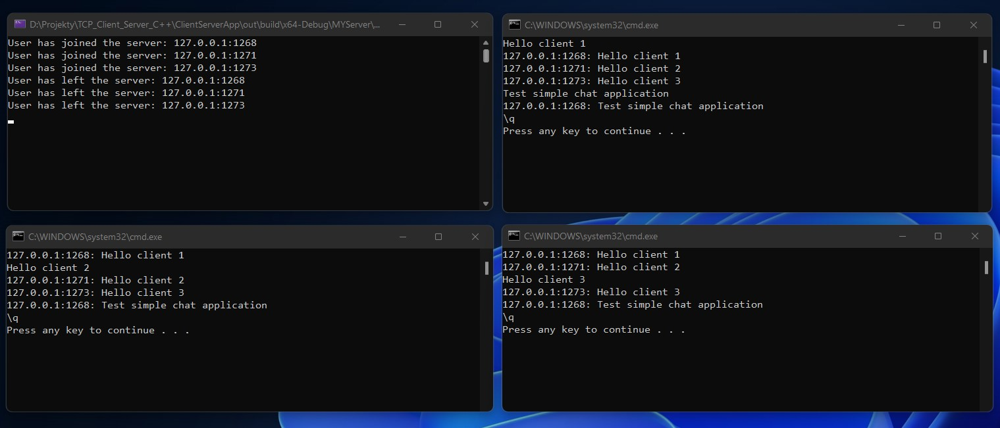
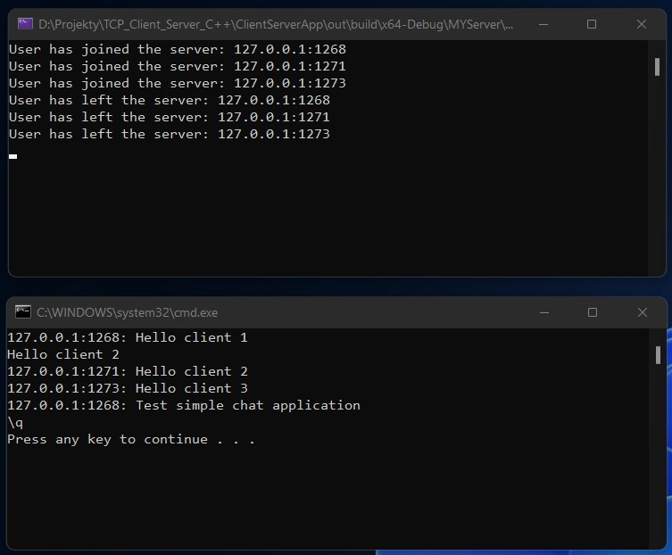
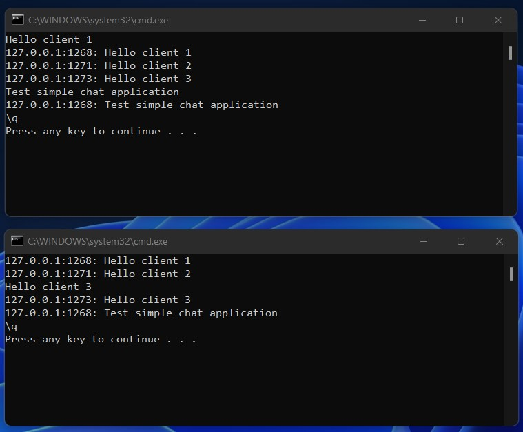

# Chat application
A simple messenger application built using the Boost Asio library.

## The app includes
- ***Server applications***
- ***Client applications***

The server serves multiple clients simultaneously. A message sent from one client is also visible to other clients connected to the server.

